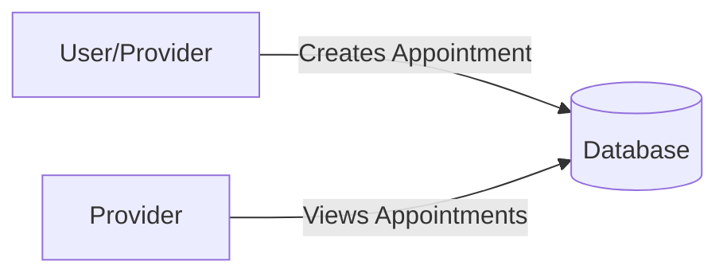
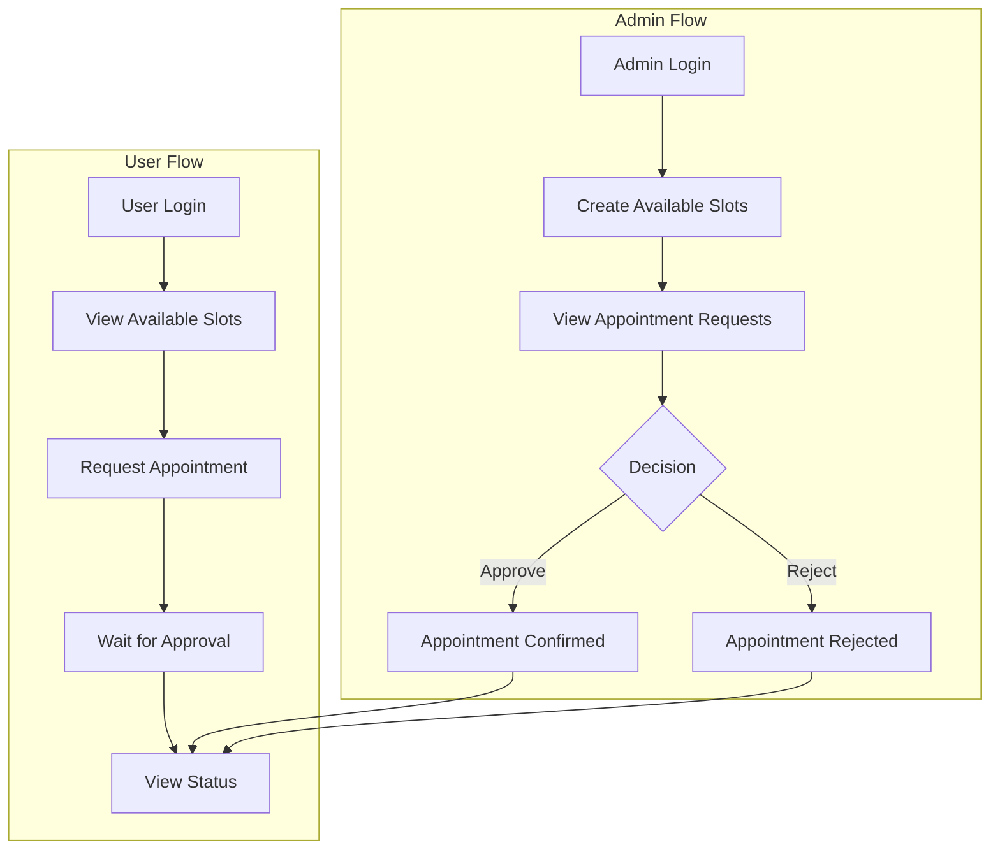
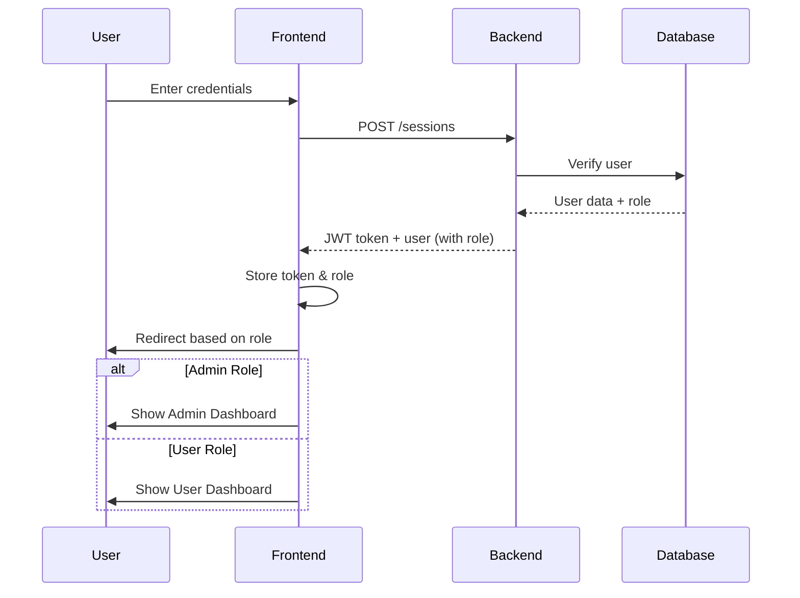
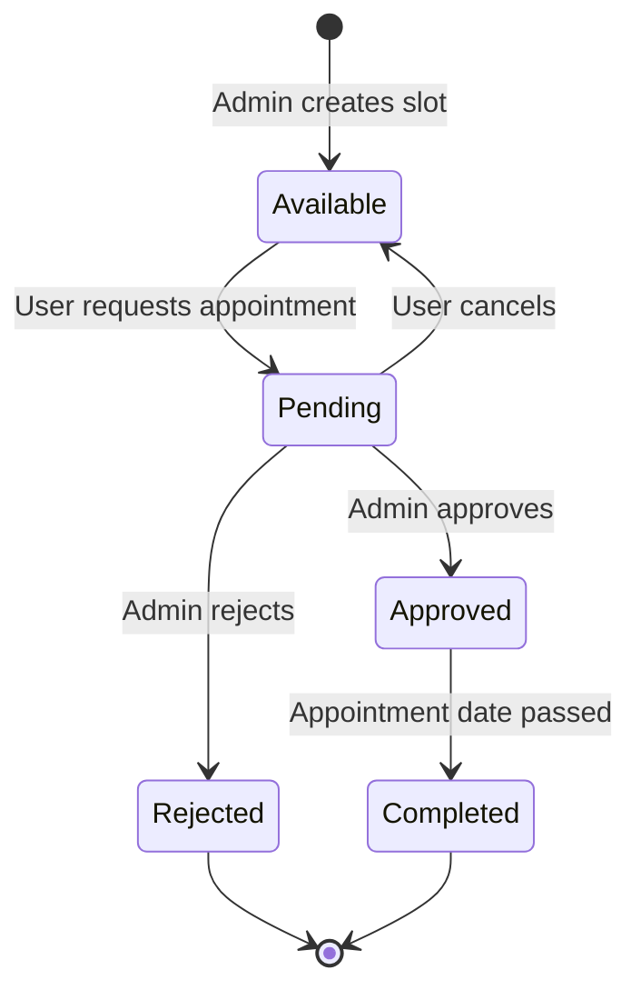

# Appointment Scheduling System - Architecture Document

## Overview
This document outlines the architecture for implementing an admin-controlled appointment scheduling system in GoBarber.

## Current System Flow


## New System Flow


## Database Schema Changes

### User Entity
```typescript
interface User {
  id: string;
  name: string;
  email: string;
  password: string;
  avatar: string;
  role: 'admin' | 'user';  // NEW FIELD
  created_at: Date;
  updated_at: Date;
}
```

### Appointment Entity
```typescript
interface Appointment {
  id: string;
  provider_id: string;  // References admin
  user_id: string;      // References requesting user
  date: Date;
  status: 'pending' | 'approved' | 'rejected' | 'cancelled';  // NEW FIELD
  created_at: Date;
  updated_at: Date;
}
```

### AvailableSlot Entity (NEW)
```typescript
interface AvailableSlot {
  id: string;
  admin_id: string;     // Admin who created it
  date: Date;           // Specific date and time
  is_available: boolean;
  created_at: Date;
  updated_at: Date;
}
```

## API Endpoints

### Admin Endpoints
| Method | Endpoint | Description |
|--------|----------|-------------|
| POST | /admin/slots | Create available appointment slots |
| GET | /admin/slots | List all available slots |
| DELETE | /admin/slots/:id | Remove an available slot |
| GET | /admin/appointments | List all appointment requests |
| PATCH | /admin/appointments/:id/approve | Approve an appointment |
| PATCH | /admin/appointments/:id/reject | Reject an appointment |

### User Endpoints
| Method | Endpoint | Description |
|--------|----------|-------------|
| GET | /slots/available | Get available slots for booking |
| POST | /appointments | Request an appointment (creates pending) |
| GET | /appointments/my | List user's appointments with status |
| DELETE | /appointments/:id | Cancel pending appointment |

## Role-Based Access Control

### Admin Role
- Can create/remove available appointment slots
- Can view all appointment requests
- Can approve or reject appointments
- Has separate dashboard

### User Role
- Can view available slots
- Can request appointments (creates pending status)
- Can view their appointment status
- Can cancel pending appointments

## Frontend Structure

### Admin Pages
- `/admin/dashboard` - Main admin dashboard
- `/admin/slots` - Manage available slots
- `/admin/requests` - View and manage appointment requests

### User Pages
- `/dashboard` - Updated to show available slots
- `/my-appointments` - View appointment history and status

## Authentication Flow


## Appointment Lifecycle


## Security Considerations
1. **Middleware**: `ensureAdmin` middleware to protect admin routes
2. **Validation**: Celebrate/Joi validation on all inputs
3. **Authorization**: Check user role in service layer
4. **Authentication**: JWT tokens with role claims

## Implementation Phases
1. **Phase 1**: Database entities and migrations
2. **Phase 2**: Repository and service layers (backend)
3. **Phase 3**: HTTP controllers and routes (backend)
4. **Phase 4**: Frontend authentication updates
5. **Phase 5**: Admin dashboard components
6. **Phase 6**: User dashboard updates
7. **Phase 7**: Testing and validation
